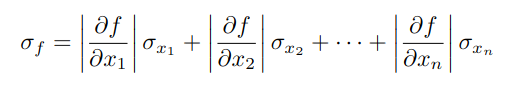

# Calculadora de Propagación de Errores

Esta calculadora web permite realizar cálculos de propagación de errores para funciones matemáticas utilizando mediciones y errores asociados. Además, puede generar derivadas parciales respecto a cada variable de una función dada y devolver la expresión completa derivada de propagación de errores.

La ecuación aplicada para el cálculo es la siguiente:

## Prueba la Calculadora

Puedes probar la calculadora en el siguiente enlace:
[Calculadora de Propagación de Errores](https://bryanalexismereles.github.io/calc_prop_de_errores/)

## Funcionalidades

- **Cálculo de Propagación de Errores**: Permite ingresar una función matemática junto a sus variables con sus errores asociados. La calculadora evaluará la propagación de errores y devolverá el resultado numérico.
- **Generación de Derivadas Parciales**: Si no se ingresan valores numéricos para las variables, el sistema generará la expresión completa de las derivadas parciales respecto a cada variable y la expresión completa para el cálculo de propagación de errores de la función dada.
- **Interfaz de Usuario**: Utiliza MathLive para la entrada de funciones en formato LaTeX y proporciona una interfaz amigable para ingresar variables y errores.

- **Copiar Resultado**: Permite copiar el resultado calculado al portapapeles.

- **Atajos de Teclado**: Incluye algunos atajos de teclado para facilitar la entrada de funciones matemáticas, como exponentes, divisiones y multiplicaciones. Se recomienda utilizar los atajos de teclado con precaución ya que no han sido testeados en su totalidad y podrían existir inconsistencias en la interpretación de las funciones ingresadas

## Uso

1. **Función**: Ingresa la función matemática para la cual deseas calcular la propagación de errores en el primer recuadro. Usa formato LaTeX y asegúrate de especificar multiplicaciones con el asterisco (\*) o la combinación de teclas equivalente para tu sistema / teclado.

2. **Variables**: En el segundo recuadro, ingresa las variables de tu función separadas por punto y coma (;). Para valores numéricos, usa el formato `variable=valor/error_medido` (por ejemplo, `x=2.3/0.1`, `x=1.58/0.02;y=2.65/0.01`).

3. **Calcular**: Presiona el botón "Calcular" para obtener los resultados. Si solo se ingresaron variables sin valores numéricos, se generará la expresión completa de la derivada parcial.

4. **Copiar Resultado**: Utiliza el botón "Copiar" para copiar el resultado al portapapeles.

5. **Atajos de Teclado**: Consulta los atajos de teclado disponibles haciendo clic en el botón "Algunos atajos de teclado".

## Donaciones

Si encuentras útil esta calculadora y deseas apoyar el proyecto, puedes hacerlo mediante una donación. Tu apoyo es muy apreciado y ayuda a mantener y mejorar el proyecto.

Puedes hacer una donación a través de Mercado Pago en el siguiente enlace:
[Haz una donación](https://link.mercadopago.com.ar/bryanmereles)

¡Gracias por tu apoyo!
